hello# 안녕하세요!

## 이건 중간제목이에요

### 소제목

그냥 글자 쓰다가 **강조** 할 때는??

> 인용문 쓸때는 요렇게

> > 두 칸도 됩니다.

### 리스트

- 빼기나
* 곱하기나
+ 더하기 다 됩니다. (앵간해서는 하나로 통일)
1. 안녕하세요

2. 반갑습니다.

3. 가끔 가다가 직접 써야 하는 경우

4. 편집모드에서 잘 맞춰주면 된다!

문법이다 보니..... 소스코드랑 겹치는 경우가 있습니다.
파이썬에서는 메모남길 때 #을 쓰는데 

1옆에 백틱 ! 활용하면 된다.

간단한 단어를 따로 빼야 하는 경우에도? 백틱

파이썬에서 `주석`을 처리 할 때는 `#`을 사용합니다.

```python
# 이건 코드 설명 입니다.
print('Hello')
```


파일 자체에 이미지가 들어가는게 아닙니다! 참조만 합니다.
만약에 이미지가 포함된 markdown을 제출하려면? 이미지도 같이 제출 해야 한다!
그런데 경로는 작업한 컴퓨터에만 있는 경로인데? 이 경로는 '절대 경로'
파일 제출을 README.md + image.jpg를 제출할건데... '상대 경로' 가 필요하다(README.md를 기준으로 )
제출할 파일 README 을 기준으로 하는 위치를 알려주자.

----

[네이버](https://naver.com) 

# 조경호 포트폴리오

------

> 조경호(KyungHo Jo) 

----

## 자기소개 / INTRO

say something

------

## Projects

----

1. 교내 스토리텔링 기반 가상현실 콘텐츠 제작 경진대회 (공모전) - 기획 / 발표 
   – 악플에 대한 VR게임 제작 2019년 (교내 대상 / 우수상 )

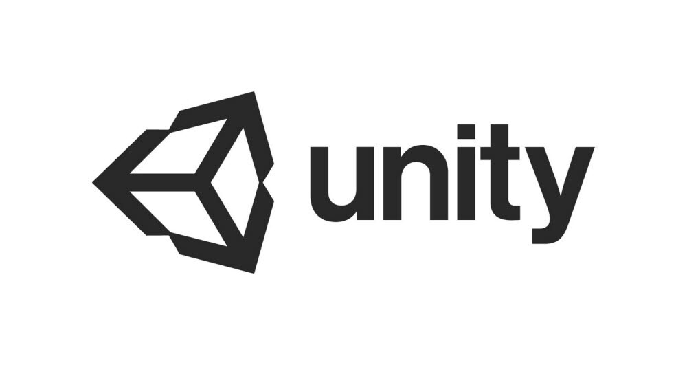

2. 벤처아카데미 포디랜드 미니 인턴 팀장 – 기획 / 총괄 PM 
   
   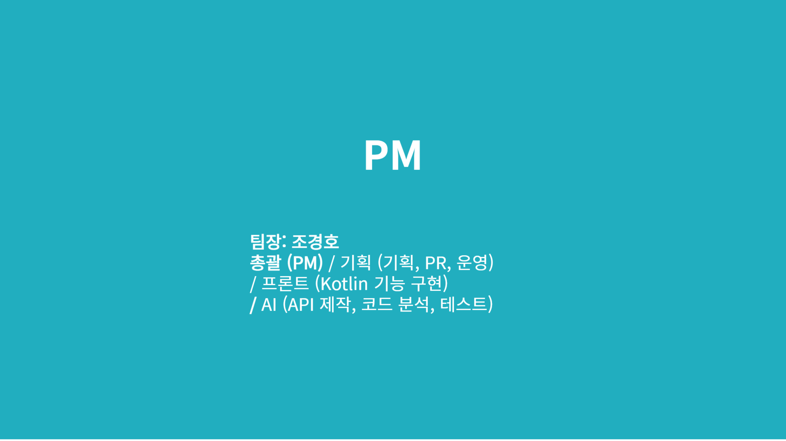
   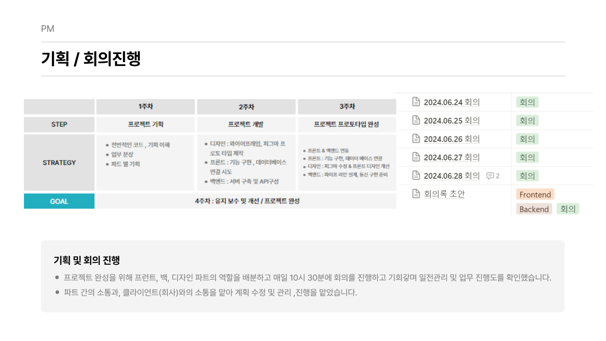
   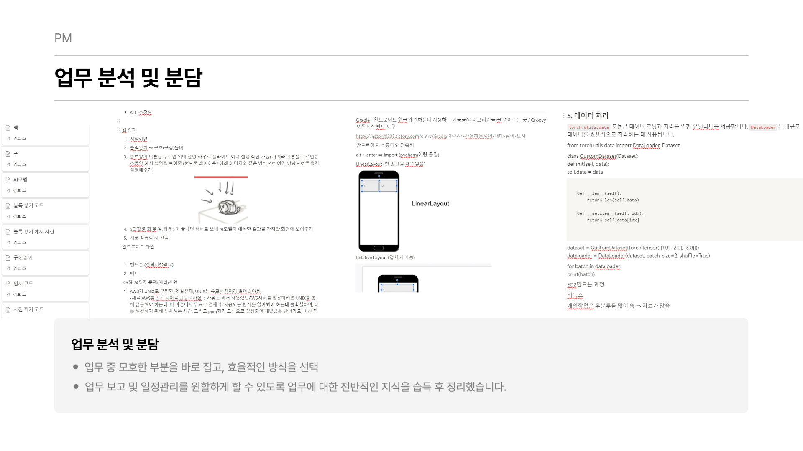
   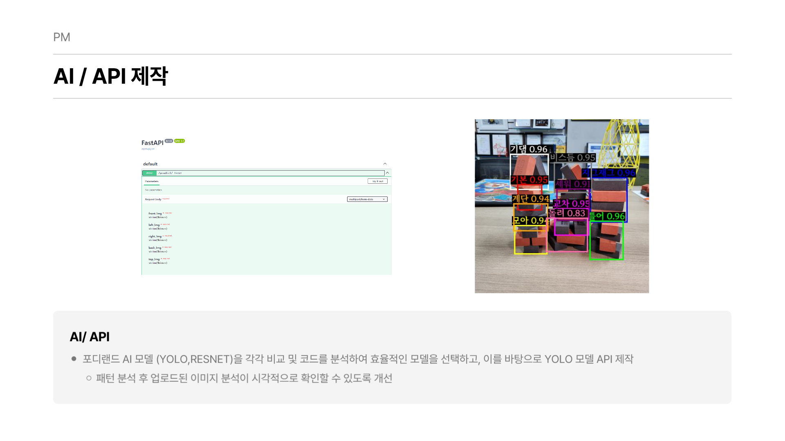
   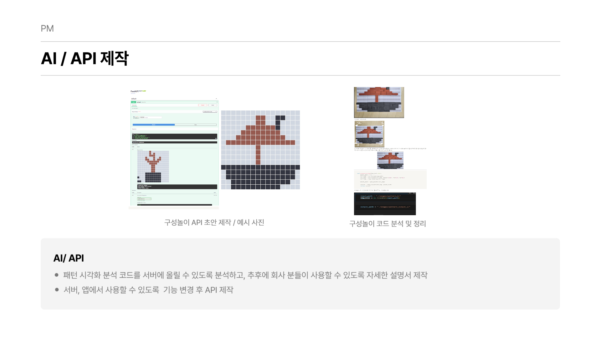
   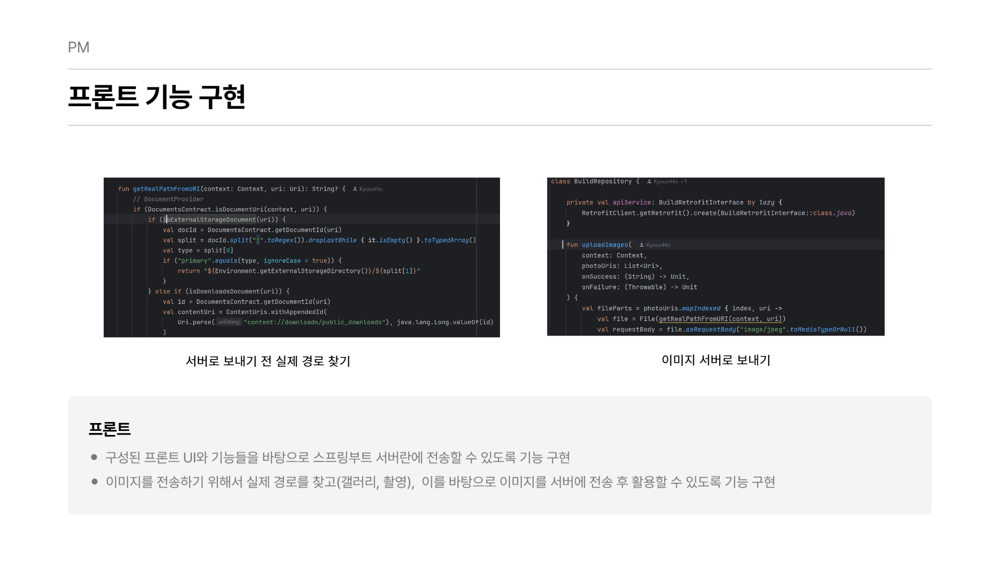
   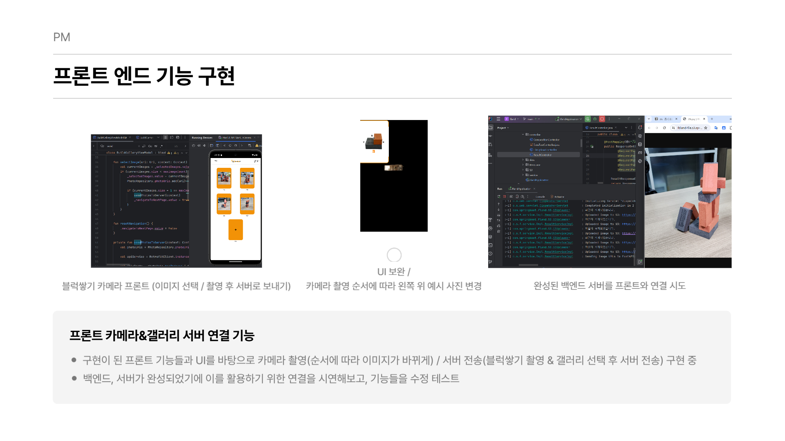

3. SW 콘텐츠 분야 벤처 – 스타트업 아카데미 해커톤 ‘강’팀 팀장 및 총괄 / 발표 (장려상) 
   
   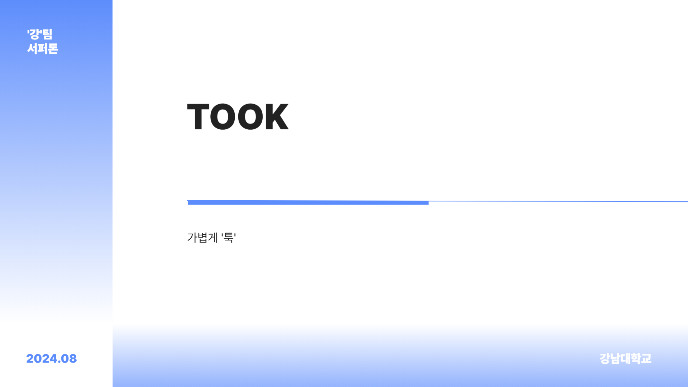
   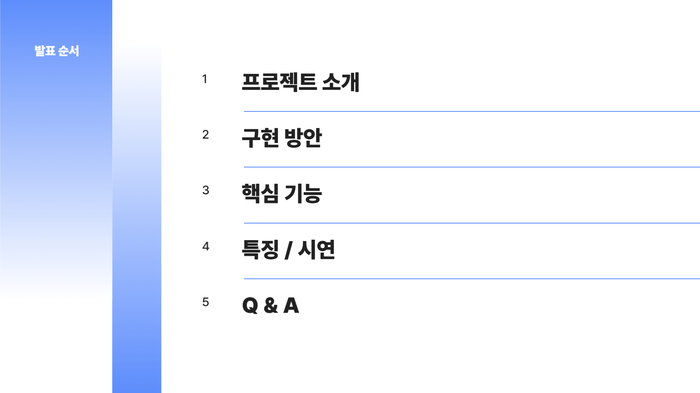
   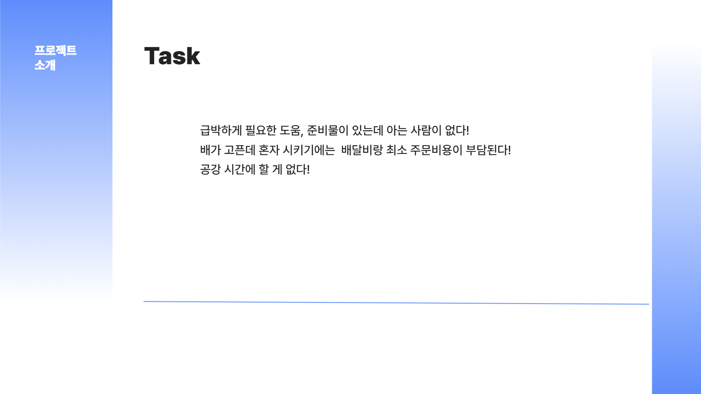
   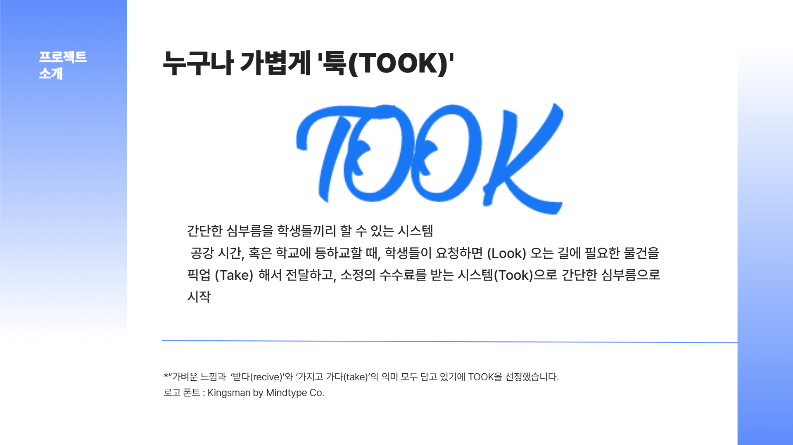
   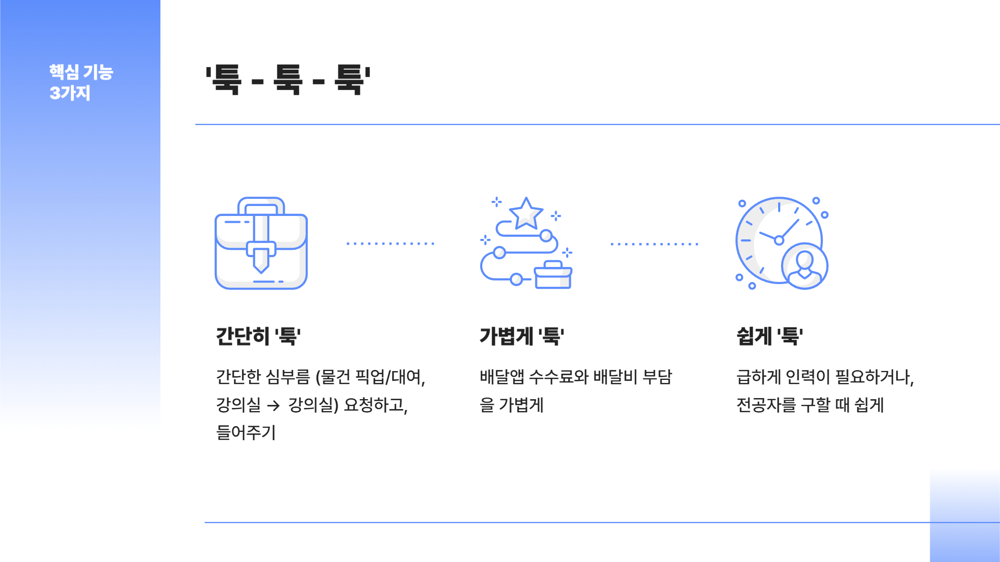
   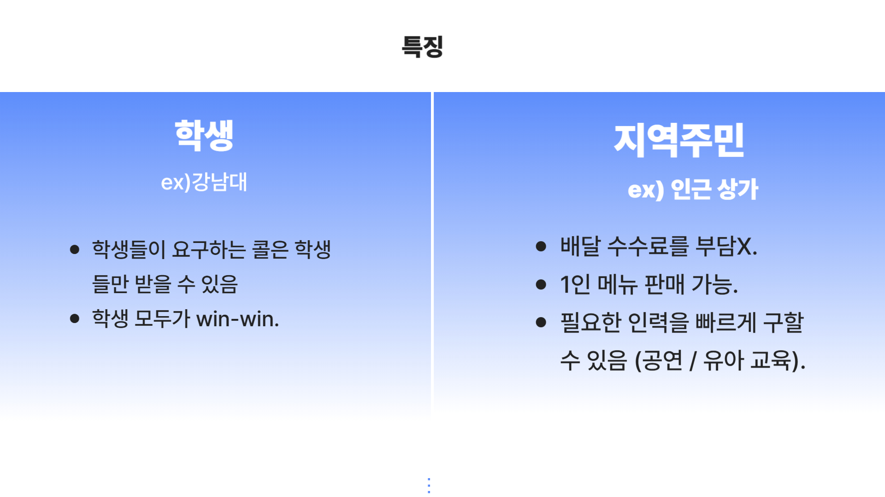

4. IMSCC(국제수리과학창대회) / 포디프레임학회 캡스톤 부문 은상 (PM/팀장) - 인턴할 때 만들었던 앱을 디벨롭하여 발표 
   

5. OOTD (AI 사용자 기반 옷 추천 서비스) - 백엔드 / AI학습 / 기획 
   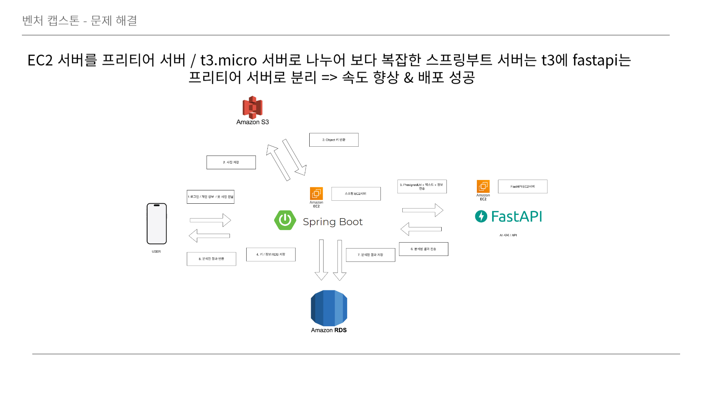
   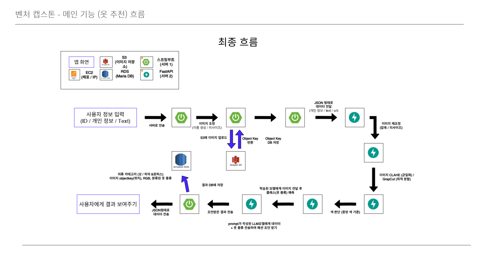
   
   ---
   
   ## 기타

6. 2019 교내 지피지기 팀장 (국내 탐방프로그램) - 해녀분들의 삶에 대한 인터뷰 진행 

7. 교내 국제학생단 프렌즈(외국인 멘토링 프로그램) - 2019

8. 교내 마음나눔센터 서포터즈 1,2기 부팀장 – 영상 편집 / 기획 / 촬영 / 스토리 제작 / 카드 뉴스 제작 - 2021

9. 한국장학재단 멘토링 – 팀장 (5년 째 만남 가지는 중) - 2021